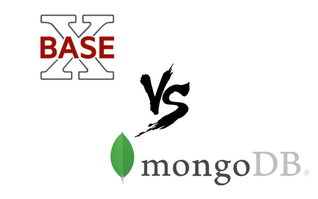

Trabalho-BD
===========
Trabalho da disciplina de **banco de dados 2** do 4º ano do Instituto Militar de Engenharia, utilizando bancos de dados baseados em documentos *XML* e *JSON*.

## Enunciado
O trabalho deve ser feito em etapas, descritas a seguir:

1. Preparar um conjunto de Documentos XML para representar os CVs dos alunos do grupo atual, e de uma turma de alunos já formados da COMP do IME. A base deve ter em torno de 25 CVs, com estruturas variadas. 

2. Preparar um esquema XML (na linguagem xml schema) que apresente flexibilidade e reuso (e.g. tag any, tag choice, tag ref, etc.), de modo a validar pelo menos 5 dos CVs da base de documentos criada na primeira etapa. O esquema deve utilizar restrições de domínio e de formato. O esquema deve estar com comentários indicando onde e justificando o uso dos recursos de flexibilidade e reuso. 

3. Para os CVs com estrutura muito diferente, utiilizar expressões XQuery que possam transformar os documentos não validados pelo Schema criado, em documentos válidos. 

4. A base de documentos CVs deve ser convertida em formato JSON, e carregada no SGBD MONGODB. Construir 4 consultas úteis sobre a base de documentos, onde pelo menos 1 deve ter a operação "unwind". CAda consulta deve retornar com resultado pelo menos 2 documentos da base.

**Entrega**: Um unico arquivo ZIP com o nome dos alunos e a sigla TI, contendo:

-  a Base de documentos criada com todos os documentos validados pelo schema
-  os documentos que antes não eram validados e suas respectivas queries de transformação
- o Schema criado
- a base com os documentos já convertidos em JSON
- As consultas sobre a base JSON, descritas em português e na linguagem de consulta do MONGODB. 

Os alunos devem apresentar o trabalho em aula nada data combinada relatando, como foi feita cada etapa. Nas primeiras etapas, as dificuldades com a heterogeneidade e construção do esquema flexível devem ser destacadas. As consultas no **BASEX** e no **MONGODB** devem ser executadas durante a apresentação. 

## Requisitos

- basex
- mongodb
- node e npm (apenas para a conversão de xml para json)

## Equipe

- [Bruno B. Lerner](https://github.com/BrunoLerner)
- [Bruno V. Costa](https://github.com/brunovcosta)
- [Lucas J. Cawai](https://github.com/lucascawai)
- [Lucas Ricarte](https://github.com/lucasrrt)
